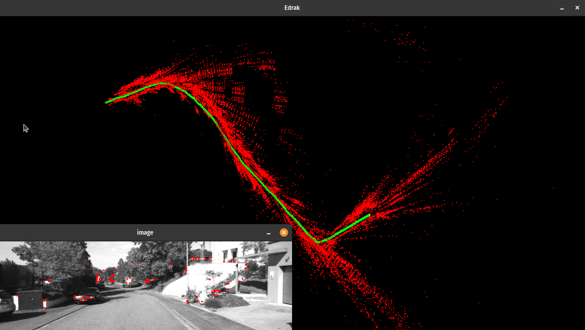
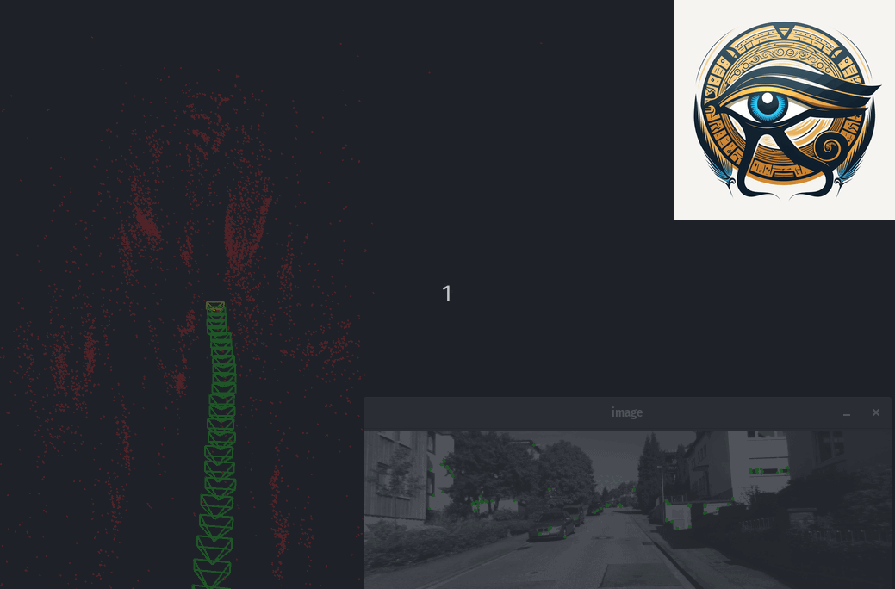

# Edrak


I have developed this library during reading the [slambook](https://github.com/gaoxiang12/slambook-en)
  by Xiang Gao, Tao Zhang, Qinrui Yan and Yi Liu.

[](https://github.com/HemaZ/Edrak/actions/workflows/conan.yml)


## How to build

[Conan](https://conan.io/) package manager is used to install all the dependencies. Please install it first from [here](https://conan.io/downloads.html)

1. Install Pangloin

```console 
$ git clone --recursive https://github.com/stevenlovegrove/Pangolin.git && cd Pangolin  && sudo apt update && ./scripts/install_prerequisites.sh recommended && cmake -B build && cmake --build build && sudo cmake --install build
```

2. Install g2o

```console 
$ sudo apt update && sudo apt install -y libcxsparse3 libsuitesparse-dev && git clone https://github.com/RainerKuemmerle/g2o.git && cd g2o && cmake -B build && cmake --build build && sudo cmake --install build

```
3. Build the project using Conan & Cmake

```console
$ mkdir build && cd build
$ conan install .. -s build_type=Debug --build missing
$ cmake .. -DCMAKE_BUILD_TYPE=DEBUG
$ make
```

## Run on KITTI VO sequence 

1. Download KITTI VO sequences from here [Visual Odometry / SLAM Evaluation 2012](https://www.cvlibs.net/datasets/kitti/eval_odometry.php)
2. Extract the sequence and optionally add a settings file inside the sequence
3. Run the KITTI_VO binary from build/bin/
  ```console 
  $ ./build/bin/KITTI_VO /SEQUENCE_PATH/SEQUENCE_NUMBER [-s/--headless] [-ba/--run-ba]
  ```

# Screenshots 
KITTI Dataset 



