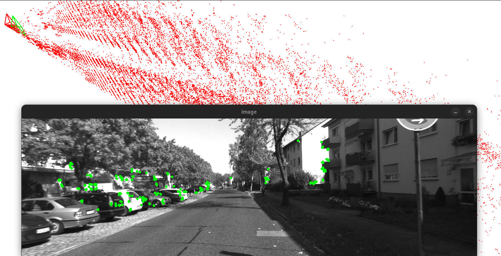

# Edrak


I have developed this library during reading the [slambook](https://github.com/gaoxiang12/slambook-en)
  by Xiang Gao, Tao Zhang, Qinrui Yan and Yi Liu.

[](https://github.com/HemaZ/Edrak/actions/workflows/conan.yml)


## How to build

[Conan](https://conan.io/) package manager is used to install all the dependencies. Please install it first from [here](https://conan.io/downloads.html)

```console
$ mkdir build && cd build
$ conan install .. -s build_type=Debug --build missing
$ cmake .. -DCMAKE_BUILD_TYPE=DEBUG
$ make
```

# Screenshots 
KITTI Dataset 
